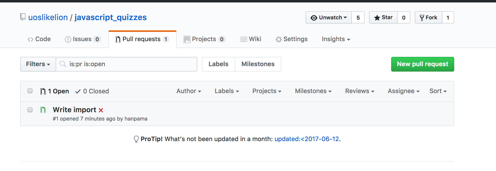

# 자바스크립트 퀴즈

실제로 자바스크립트 프로그래밍을 하는 데 유용한 개념들에 대한 퀴즈입니다.

## 설치 및 사용법

1. 이 저장소를 fork 해서 각자 저장소로 만들어 주세요.
2. fork한 저장소를 자신의 컴퓨터에 clone 하고 설치해 주세요. 명령어는 아래와 같습니다.
```sh
git clone https://github.com/나의깃헙아이디/javascript_quizzes
cd javascript_quizzes
npm install
```
3. 아래의 명령어로 코드를 잘 짰나 테스트 해볼 수 있습니다.
```sh
npm test
```

4. 짠 코드는 git commit 해서 자신의 저장소에 올립니다.
5. 그리고 uoslikelion의 저장소로 pull-request를 보냅니다. 그러면 메인 저장소인 uoslikelion/javascript_quizzes에서 다른 사람들이 짠 코드들을 모아 볼 수 있어요.



이렇게 나옵니다.

저기 풀 리퀘스트 옆에 빨간 X가 된 것은 코드가 테스트 결과를 통과하지 못했다는 뜻입니다.
테스트를 통과하는 코드로 만들려면 더 작업이 필요하다는 이야기입니다.

(테스트 결과가 나오는 이유는 pull request가 오면 자동으로 npm test를 해 보도록 깃헙을
설정했기 때문입니다.)

## 테스트에 대해서

```sh
npm test
```

위의 명령은 각 폴더의 `q*.test.js` 자바스크립트 파일을 실행해 보고 결과를 보여줍니다.

각 퀴즈의 `q*.test.js` 파일에는 어떻게 코드를 작성해야 하는지 설명이 되어 있습니다.
맞추어 코드를 작성하고 모든 테스트를 통과시키세요!

## 오류!

처음 테스트하게 되면 오류가 발생합니다. 아마 아래와 같은 모양일 것입니다.
오류는 보통 예상하지 못한 메시지를 상세하게, 또 영어로 마구 쏟아내기 때문에 자세히 보기 어렵습니다.

그래도 중요한 메시지가 모두 담겨 있으니 꼭 읽으세요. 그래야 문제를 해결할 수 있습니다.

```
~/W/javascript_quizzes (master|●8) $ npm test

> javascript_quizzes@1.0.0 test /Users/me/Workspace/javascript_quizzes
> jest

 FAIL  q1_modules/test.js
  ● Test suite failed to run

    Cannot find module './baz/bazFile' from 'test.js'

      at Resolver.resolveModule (node_modules/jest-resolve/build/index.js:179:17)
      at Object.<anonymous> (q1_modules/test.js:3:16)

 FAIL  q2_class/test.js
  ● Q2_Double › encountered a declaration exception

    TypeError: doubleOfTwo.getValue is not a function

      at Suite.<anonymous> (q2_class/test.js:13:22)
      at Object.<anonymous> (q2_class/test.js:12:1)
      at handle (node_modules/worker-farm/lib/child/index.js:44:8)
      at process.<anonymous> (node_modules/worker-farm/lib/child/index.js:51:3)
      at emitTwo (events.js:125:13)
      at process.emit (events.js:213:7)
      at emit (internal/child_process.js:742:12)
      at _combinedTickCallback (internal/process/next_tick.js:105:11)
      at process._tickCallback (internal/process/next_tick.js:161:9)

Test Suites: 2 failed, 2 total
Tests:       1 failed, 1 total
Snapshots:   0 total
Time:        2.048s
Ran all test suites.
npm ERR! Test failed.  See above for more details.
```

이 경우, 첫 번째 테스트에서는
`Cannot find module './baz/bazFile' from 'test.js'`,
그리고 두 번째 테스트에서는
`TypeError: doubleOfTwo.getValue is not a function`라고 합니다.

이런 정보를 알고 있으면 코드를 어떻게 수정해야 할 지 더 명확해집니다.
